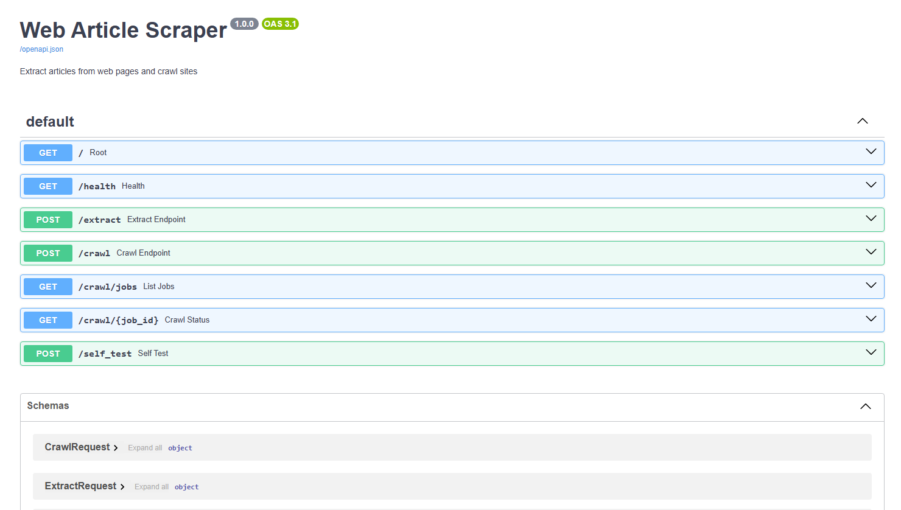

# Article Scraper API

Extracts articles from web pages and crawls sites for content.

## Quick Start

```bash
pip install -r requirements.txt
python app.py
```
if running locally use http://localhost:3888/docs for interactive API docs.

if running deployed version use https://webcrawler.coolify.zareinnovations.xyz/docs for interactive API docs.

Here is the deployed version https://webcrawler.coolify.zareinnovations.xyz/docs.



## Endpoints

| Method | Endpoint | What it does |
|--------|----------|--------------|
| POST | `/extract` | Extract single article |
| POST | `/crawl` | Start site crawl |
| GET | `/crawl/jobs` | List all crawl jobs |
| GET | `/crawl/{id}` | Get crawl results |
| POST | `/self_test` | Check if the text extraction works for specific website|

## Examples

**Extract article:**
```json
POST /extract
{"url": "https://martinfowler.com/articles/design-token-based-ui-architecture.html"}
```

**Crawl site:**
```json
POST /crawl
{"start_url": "https://martinfowler.com", "max_pages": 20}
```

## Docker

```bash
docker-compose up
```

Results saved to `data/` folder.
